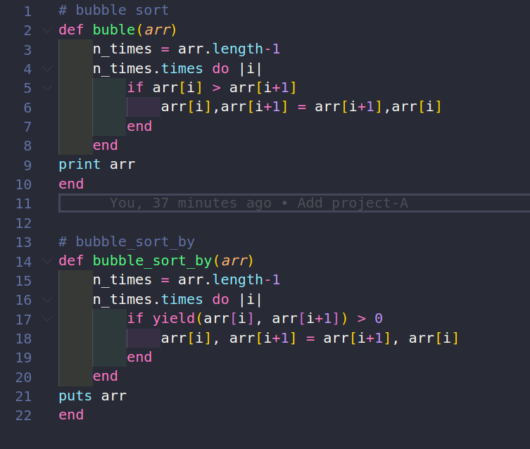

# Ruby Project - Advanced Building BLocks - Bubble Sort

This is the Ruby project #1, from the Microverse's main curriculum and aims to build two algorithms similar to the sorting method, without using those methods.

## Built With

- Ruby

### Prerequisites

- Ruby

- VS Code

## Setup 

- Install git

- Open Terminal

- Change directory to folder to download repository

- Use cd <file-path>

- Run git clone https://github.com/ozovalihasan/enumerable.git

- Install Ruby

- Run ruby main.rb

- To make any change,

## Author

👤 **Heber Lazo**

- [@lazo_heber](https://www.linkedin.com/in/heber-lazo-benza-523266133/) [][linkedin]

- [@lazo_heber](https://twitter.com/lazo_heber) [][twitter]

👤 **German Aquila**

- GitHub: [@realisticattorney](https://github.com/realisticattorney)
- Twitter: [@ContoliAxl](https://www.twitter.com/contoliaxl)
- Linkedin: [@germanaquila](https://www.linkedin.com/in/german-aquila-55a9171b5/)

## 🤝 Contributing

Contributions, issues, and feature requests are welcome!

Feel free to check the [issues page](https://github.com/realisticattorney/CapstoneProject/issues)

## Show your support

Give a ⭐️ if you like this project!

## 📝 License

This project is [MIT](./LICENSE).
